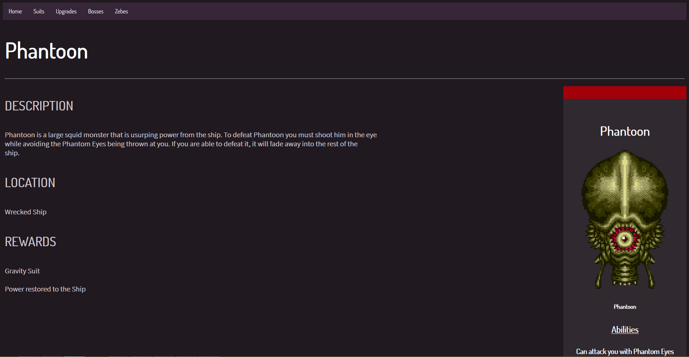

# Super Metroid Guide

## General info
<h3><b>This was a guide created for Super Metroid</b></h3>

The link to the site can be found <a href='https://italiancucumber.github.io/super-metroid-guide/'>here</a>

<b>It has 20 wiki pages with sprites, descriptions and other information that could be useful.</b>  

<b>The guide features 3 categories with menus to any page within the category.</b>  

<b>This guide has a header that shows up on each page and is simple to navigate.</b>  

## Technology used
This project was created with the following:
* HTML
* CSS
* JavaScript
